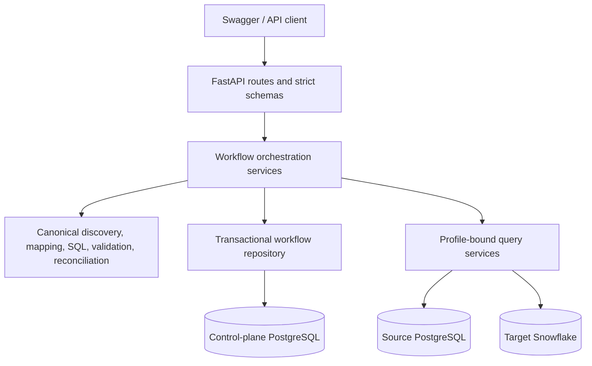

# SchemaBridge

SchemaBridge is a governed PostgreSQL-to-Snowflake schema migration backend. It discovers canonical metadata, proposes deterministic column mappings, requires human approval, compiles safe Snowflake SQL, executes through named profiles, validates and reconciles source and target aggregates, and stores an immutable workflow history.

The project is designed as a placement-ready backend demonstration: its automated core suite runs without production credentials, and the documentation distinguishes that coverage from optional live-database checks.

## The problem it solves

Database migrations often mix metadata inspection, mapping decisions, SQL construction, credentials, execution, and verification in one opaque script. SchemaBridge separates those concerns into durable, reviewable steps. Mutations are idempotent, post-creation updates use optimistic concurrency, and execution accepts artifact references rather than client-provided SQL.

## Core workflow

```mermaid
flowchart LR
    A["Create workflow"] --> B["Discover PostgreSQL source"]
    B --> C["Discover Snowflake target"]
    C --> D["Generate deterministic mappings"]
    D --> E["Human approval"]
    E --> F["Compile Snowflake preview"]
    F --> G["Execute approved migration"]
    G --> H["Run paired validation"]
    H --> I["Reconcile results"]
    I --> J["Validated or review required"]
```



## Architecture



The control plane stores workflow state, immutable artifacts, idempotency records, execution attempts, validation runs, and append-only audit events. Source and target credentials stay in named runtime profiles and are never persisted in workflow artifacts.

## Implemented scope

- Canonical PostgreSQL and Snowflake schema discovery.
- Deterministic, explainable column mapping and manual approval.
- Safe Snowflake `SELECT` and `INSERT ... SELECT` compilation.
- Profile-bound, write-authorized Snowflake migration execution.
- Paired PostgreSQL/Snowflake aggregate validation and reconciliation.
- Durable FastAPI workflows, artifacts, audit history, retries, and recovery quarantine.
- Legacy MCP database tools and connector extension points remain under `clean_mcp/`.

Workflow execution is currently PostgreSQL source to Snowflake target. MySQL and SQL Server exist in the older generic connector layer; they are not production migration-execution targets for the durable workflow.

## Safety model

- A reviewed mapping artifact is required before transformation compilation.
- The workflow execution API does not accept arbitrary SQL.
- Credentials are resolved only through persisted profile identifiers.
- Snowflake migration writes require `write_enabled=true` on the target profile.
- Validation is generated by SchemaBridge and remains read-only.
- Every mutation requires an `Idempotency-Key`.
- After creation, workflow mutations carry the expected workflow version for optimistic concurrency.
- Artifacts are immutable, versioned, hashed, and audited.
- Confirmed rollback permits an explicit retry; uncertain execution or validation is quarantined for manual investigation.
- Driver errors, DSNs, hosts, passwords, and query parameters are excluded from public errors and audit metadata.

## Workflow states

Planning uses `DRAFT`, `DISCOVERED`, `MAPPING_PROPOSED`, and `MAPPING_APPROVED`. Execution uses `EXECUTION_READY`, `EXECUTING`, `EXECUTED`, and `EXECUTION_RECOVERY_REQUIRED`. Validation uses `VALIDATION_READY`, `VALIDATING`, `VALIDATED`, `VALIDATION_REVIEW_REQUIRED`, and `VALIDATION_RECOVERY_REQUIRED`. `FAILED` and `CANCELLED` are terminal administrative outcomes.

## Artifact types

1. `SOURCE_DISCOVERY`
2. `TARGET_DISCOVERY`
3. `MAPPING_PLAN`
4. `APPROVED_MAPPING_PLAN`
5. `TRANSFORMATION_PREVIEW`
6. `EXECUTION_EVIDENCE`
7. `VALIDATION_PREVIEW`
8. `VALIDATION_EXECUTION_REPORT`

## Local setup

Requirements: Git and Python 3.12 or later. Docker Desktop or Docker Engine with Compose v2 is required only for the containerized setup. The image is pinned to Python 3.12.11.

### Windows PowerShell

```powershell
git clone <repository-url>
cd schemabridge
PowerShell -ExecutionPolicy Bypass -File .\clean_mcp\scripts\setup.ps1
Copy-Item .\.env.example .\.env
```

The setup script creates `.venv`, upgrades pip to the repository minimum, and installs `clean_mcp/requirements.txt`, including test dependencies.

### macOS, Linux, or another POSIX shell

```bash
git clone <repository-url>
cd schemabridge
python3 -m venv .venv
. .venv/bin/activate
python -m pip install "pip>=26.1.2"
python -m pip install -r clean_mcp/requirements.txt
cp .env.example .env
```

The checked-in example contains local demonstration defaults and placeholder integration values. Replace placeholders only in the ignored `.env`; never commit credentials. `clean_mcp/requirements-api.lock` is the pinned API-only dependency set used by the Docker image, while `clean_mcp/requirements.txt` includes the development and test tools.

## Configuration and database roles

These databases have separate responsibilities and configuration:

| Role | Purpose | Configuration |
|---|---|---|
| Control-plane PostgreSQL | Stores workflows, immutable artifacts, idempotency records, execution attempts, validation runs, and audit events. It never acts as the migration source. | `SCHEMABRIDGE_CONTROL_PLANE_DSN` |
| Source PostgreSQL | Read-only schema discovery and source-side validation for a workflow. | A named PostgreSQL entry in `DB_PROFILES_JSON` |
| Target Snowflake | Target discovery, approved `INSERT ... SELECT` execution, and target-side validation. | A named Snowflake entry in `DB_PROFILES_JSON` |

`SCHEMABRIDGE_CONTROL_PLANE_DSN` is required to use durable workflow endpoints or run migrations. The FastAPI process can still start without it, but persistence-dependent operations are unavailable. Real discovery, execution, and validation additionally require the corresponding named profiles. The credential-free test suite does not require any live-database credentials.

The root `.env.example` documents every local setting used by this workflow:

- Compose: `SCHEMABRIDGE_API_PORT`, `SCHEMABRIDGE_CONTROL_PLANE_PORT`, `SCHEMABRIDGE_CONTROL_PLANE_DB`, `SCHEMABRIDGE_CONTROL_PLANE_USER`, and `SCHEMABRIDGE_CONTROL_PLANE_PASSWORD`.
- Control plane: `SCHEMABRIDGE_CONTROL_PLANE_DSN`.
- Named profiles: `DB_PROFILES_JSON` and `DB_ACTIVE_PROFILE`.
- Connector defaults and limits: `DB_TYPE`, `DB_HOST`, `DB_DATABASE`, `DB_USERNAME`, `DB_PASSWORD`, `DB_CONNECTION_OPTIONS`, `DB_TIMEOUT_SECONDS`, `DB_MAX_ROWS`, and `LOG_LEVEL`.
- Optional tests: `SCHEMABRIDGE_RUN_CONTROL_PLANE_INTEGRATION`, `SCHEMABRIDGE_CONTROL_PLANE_TEST_DSN`, `SCHEMABRIDGE_POSTGRES_INTEGRATION`, `SCHEMABRIDGE_POSTGRES_HOST`, `SCHEMABRIDGE_POSTGRES_PORT`, `SCHEMABRIDGE_POSTGRES_DATABASE`, `SCHEMABRIDGE_POSTGRES_USERNAME`, `SCHEMABRIDGE_POSTGRES_PASSWORD`, and `DB_SMOKE_TEST_CONNECT`.

The Compose defaults are for a disposable local control plane. Angle-bracket values are placeholders, not usable credentials. Production secrets must be supplied outside Git.

### Named profiles and write authorization

`DB_PROFILES_JSON` is a JSON object keyed by profile ID. Workflows persist only those IDs; the runtime resolves the corresponding host, database, username, password, connector options, timeout, row limit, and `write_enabled` value. Profiles default to `write_enabled=false`.

Source discovery and validation do not require write authorization. Snowflake migration execution fails closed unless the exact target profile referenced by the workflow exists, uses the supported Snowflake execution connector, and explicitly has `write_enabled=true`. Enabling writes authorizes the profile boundary; it does not bypass mapping approval, artifact-version checks, generated-SQL validation, idempotency, or optimistic concurrency.

Snowflake profile values include the account identifier, database, warehouse, schema, role, username, and secret shown as placeholders in `.env.example`. A real demonstration should use least-privilege non-production databases and a target role restricted to the intended objects.

## Run the API on the host

Start only the local control plane, apply migrations, and then run the API:

```powershell
docker compose up -d control-plane
.\.venv\Scripts\python.exe .\clean_mcp\scripts\migrate_control_plane.py
.\.venv\Scripts\python.exe -m uvicorn clean_mcp.api.app:create_app --factory --env-file .env --host 127.0.0.1 --port 8000
```

POSIX-shell equivalent:

```bash
docker compose up -d control-plane
.venv/bin/python clean_mcp/scripts/migrate_control_plane.py
.venv/bin/python -m uvicorn clean_mcp.api.app:create_app --factory --env-file .env --host 127.0.0.1 --port 8000
```

Open:

- Swagger UI: <http://localhost:8000/docs>
- OpenAPI JSON: <http://localhost:8000/openapi.json>
- Liveness: <http://localhost:8000/health/live>
- Readiness: <http://localhost:8000/health/ready>

The API can start without real source PostgreSQL or target Snowflake profiles. Operations that require an unavailable profile fail closed with sanitized errors.

## Docker Compose

```powershell
Copy-Item .\.env.example .\.env
docker compose config
docker compose up --build -d
docker compose ps
```

In a POSIX shell, use `cp .env.example .env`; the `docker compose` commands are otherwise identical.

Compose starts:

- `control-plane`: persistent PostgreSQL with a health check.
- `migrate`: a one-shot checksum-verified migration job.
- `api`: the non-root FastAPI service, started only after migrations succeed.

The Compose structure and packaging assertions are covered by credential-free tests. Docker was not available on the machine used for the latest repository verification, so the image build, running containers, and container health checks have not been claimed as locally verified.

Stop containers without deleting workflow data:

```powershell
docker compose down
```

Delete the disposable local control-plane volume only when intentional:

```powershell
docker compose down -v
```

## Control-plane migrations

Migrations are explicit and ordered:

- `0001_workflow_audit.sql`
- `0002_workflow_execution.sql`
- `0003_workflow_validation.sql`

Inspect the migration set without connecting:

```powershell
.\.venv\Scripts\python.exe .\clean_mcp\scripts\migrate_control_plane.py --check
```

Apply or re-verify it against `SCHEMABRIDGE_CONTROL_PLANE_DSN`:

```powershell
.\.venv\Scripts\python.exe .\clean_mcp\scripts\migrate_control_plane.py
```

Applied checksums are recorded. Re-running is safe; changing an already-applied migration fails rather than silently rewriting the database. Application startup does not mutate the control plane. Compose runs the same explicit migration command in its one-shot service.

## Tests

The normal suite is credential-free:

```powershell
cd clean_mcp
..\.venv\Scripts\python.exe -m pytest -q
cd ..
PowerShell -ExecutionPolicy Bypass -File .\clean_mcp\scripts\verify.ps1
```

The end-to-end workflow test uses the same FastAPI orchestration boundaries with fake remote execution and validation boundaries:

```powershell
cd clean_mcp
..\.venv\Scripts\python.exe -m pytest tests\test_workflow_end_to_end.py -q
```

Optional disposable PostgreSQL integration tests require the explicit environment flags documented in `.env.example` and a database name containing `test`.

POSIX-shell commands for the same suite are:

```bash
cd clean_mcp
../.venv/bin/python -m pytest -q
cd ..
```

## Example workflow

Create and inspect a control-plane workflow without claiming a real migration:

```powershell
.\.venv\Scripts\python.exe .\clean_mcp\scripts\demo_workflow.py
```

In a POSIX shell, run `.venv/bin/python clean_mcp/scripts/demo_workflow.py`.

After configuring real source and target profiles, discovery and mapping proposal generation can be demonstrated with:

```powershell
.\.venv\Scripts\python.exe .\clean_mcp\scripts\demo_workflow.py --discover
```

The script deliberately stops before approval and execution. The complete HTTP sequence, response-derived version handling, and separation between local and real demonstrations are in [LOCAL_WORKFLOW_DEMO.md](clean_mcp/docs/LOCAL_WORKFLOW_DEMO.md).

## Verified versus credential-gated behavior

| Area | Current evidence |
|---|---|
| Workflow state machine, persistence orchestration, approval, SQL compilation, execution claims, validation reconciliation, artifacts, audit ordering, recovery, and idempotent replay | Covered by credential-free automated tests. The comprehensive workflow test uses production FastAPI orchestration with fake remote execution and validation boundaries. |
| PostgreSQL and Snowflake discovery behavior | Covered by deterministic connector tests with fake driver responses. An optional PostgreSQL discovery integration test requires the `SCHEMABRIDGE_POSTGRES_*` variables. |
| Migrations `0001`-`0003` | Ordering, checksums, repeat behavior, schema expectations, and repository contracts are automated. The disposable live-PostgreSQL contract requires `SCHEMABRIDGE_RUN_CONTROL_PLANE_INTEGRATION=1` and `SCHEMABRIDGE_CONTROL_PLANE_TEST_DSN`. |
| Real Snowflake migration and validation | Requires real PostgreSQL/Snowflake profiles and an explicitly write-enabled, least-privilege Snowflake target. It has not been executed in this local environment. |
| Docker image and Compose runtime | Packaging is statically checked, but Docker build and container health were not run on the latest verification host because Docker was unavailable. |

## Interview demo

See [INTERVIEW_DEMO.md](clean_mcp/docs/INTERVIEW_DEMO.md) for a 5–7 minute sequence, architecture talking points, failure scenarios, and factual answers to likely questions.

## Honest limitations

- No real Snowflake migration has been executed in this local environment.
- Uncertain outcomes require manual investigation; automatic resolution is not implemented.
- Validation uses aggregate and targeted checks, not expensive full-row comparison.
- There is no authentication, frontend, background worker, AWS/PySpark, Excel/Word export, or public deployment in the durable backend.
- Docker packaging is provided for local demonstration and controlled evaluation, but the latest verification host could not run Docker and this project does not claim production readiness.
- Advanced fuzzy matching and profiling are intentionally out of scope.
