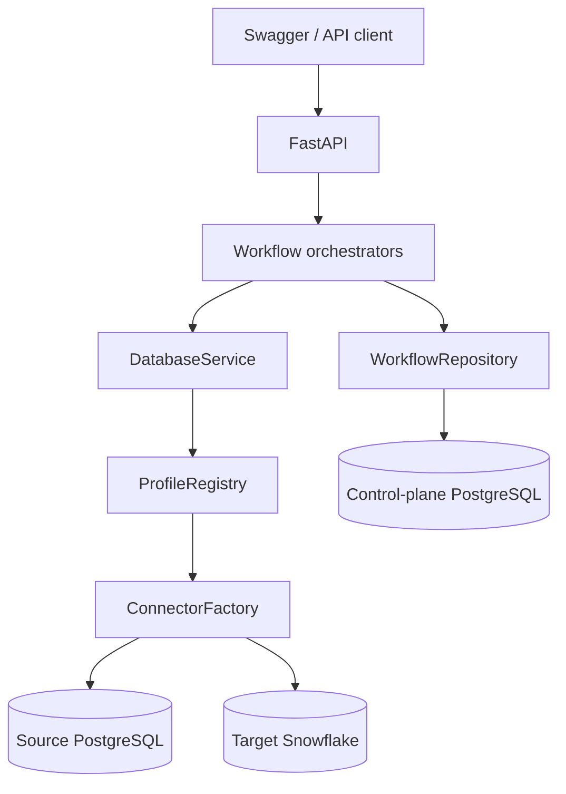

# SchemaBridge

SchemaBridge is a governed PostgreSQL-to-Snowflake migration backend. It discovers schemas, proposes deterministic column mappings, requires human approval, compiles Snowflake SQL, records execution attempts, validates source and target aggregates, and preserves an auditable workflow history.

It is a control plane, not a complete data-transfer platform. The current execution step runs `INSERT ... SELECT` inside Snowflake from a staging relation that must already be available there. SchemaBridge does not extract PostgreSQL rows or load that staging relation.

## Documentation

- [Product requirements](docs/PRD.md) — current behavior, scope, workflow, and limitations.
- [Architecture](docs/ARCHITECTURE.md) — components, request paths, databases, and design decisions.
- [Setup](docs/SETUP.md) — clean-machine setup, configuration, operation, and troubleshooting.
- [Code guide](docs/CODE_GUIDE.md) — a recommended study order and file-by-file navigation.

## Architecture at a glance



The source and target are data-plane systems. The separate control-plane PostgreSQL database stores workflow state, immutable artifacts, idempotency records, execution and validation attempts, and append-only audit events. It does not store migrated business rows.

## Current workflow

1. Create a workflow with named source and target profiles.
2. Discover canonical PostgreSQL and Snowflake metadata.
3. Generate deterministic, evidence-backed mapping suggestions.
4. Record human approval or overrides as a new immutable artifact.
5. Compile a Snowflake transformation preview from the approved plan.
6. Recompile, verify, claim, and execute the approved statement.
7. Run generated read-only aggregate checks on source and target.
8. Reconcile results into `VALIDATED` or `VALIDATION_REVIEW_REQUIRED`.

The lower-level `/api/v1/migrations` endpoints expose individual discovery, mapping, preview, and validation operations. The durable `/api/v1/migrations/workflows` endpoints add state transitions, artifacts, audit history, idempotency, optimistic concurrency, execution claims, and recovery states.

## Key safety properties

- The workflow API never accepts arbitrary migration SQL from a client.
- Execution is tied to an immutable approved mapping artifact and recompiles SQL before use.
- Identifiers are quoted and literal expression values use bound parameters.
- Target writes require a Snowflake profile with `write_enabled=true`.
- Every mutation requires an `Idempotency-Key`; later mutations also require the expected workflow version.
- Immutable, hashed artifacts preserve discovery, approval, preview, execution, and validation evidence.
- Concurrent execution and validation are guarded by durable control-plane claims.
- A remote outcome that cannot be proved is quarantined in a recovery state instead of retried automatically.
- Public errors and audit metadata exclude credentials, DSNs, hosts, query parameters, and raw driver failures.

## Quick start

Prerequisites: Git and Python 3.12 or newer. Docker Compose v2 is optional unless you want the containerized control plane.

Windows PowerShell:

```powershell
git clone <repository-url>
cd schemabridge
PowerShell -ExecutionPolicy Bypass -File .\scripts\setup.ps1
Copy-Item .\.env.example .\.env
.\.venv\Scripts\python.exe -m pytest -q
.\.venv\Scripts\python.exe -m scripts.demo_workflow
```

POSIX shell:

```bash
git clone <repository-url>
cd schemabridge
python3 -m venv .venv
. .venv/bin/activate
python -m pip install "pip>=26.1.2"
python -m pip install -r requirements-dev.txt
cp .env.example .env
python -m pytest -q
python -m scripts.demo_workflow
```

The normal tests and default demo are credential-free. The demo creates and inspects a control-plane workflow; it does not claim a real Snowflake migration.

To inspect the ordered control-plane migrations without connecting:

```powershell
.\.venv\Scripts\python.exe -m scripts.migrate_control_plane --check
```

To run the API with a local control plane, first configure `.env`, then:

```powershell
docker compose up -d control-plane
.\.venv\Scripts\python.exe -m scripts.migrate_control_plane
.\.venv\Scripts\python.exe -m uvicorn schemabridge.api.app:create_app --factory --env-file .env --host 127.0.0.1 --port 8000
```

Open Swagger UI at <http://localhost:8000/docs>. See [SETUP.md](docs/SETUP.md) for named PostgreSQL/Snowflake profiles, required credentials, Docker Compose, environment variables, and troubleshooting.

## Repository layout

```text
schemabridge/   Application, domain, connector, and persistence code
tests/          Credential-free tests and optional integration contracts
scripts/        Setup, verification, migrations, and demo commands
docs/           Product, architecture, setup, and study guides
```

## Current limitations

- No PostgreSQL row extraction or Snowflake staging loader is implemented.
- No real Snowflake migration has been verified in this local environment.
- Validation compares generated aggregates, not every row.
- Uncertain remote outcomes require manual investigation.
- The durable workflow has no authentication, background worker, frontend, file ingestion, profiling, or production deployment layer.
- MySQL and SQL Server exist behind the generic connector factory but are not supported durable migration-execution targets.
- Static packaging and Compose configuration are tested; a running Docker deployment is not claimed as verified here.

For a guided credential-free demonstration, see [LOCAL_WORKFLOW_DEMO.md](docs/LOCAL_WORKFLOW_DEMO.md). For interview preparation, see [INTERVIEW_DEMO.md](docs/INTERVIEW_DEMO.md).
