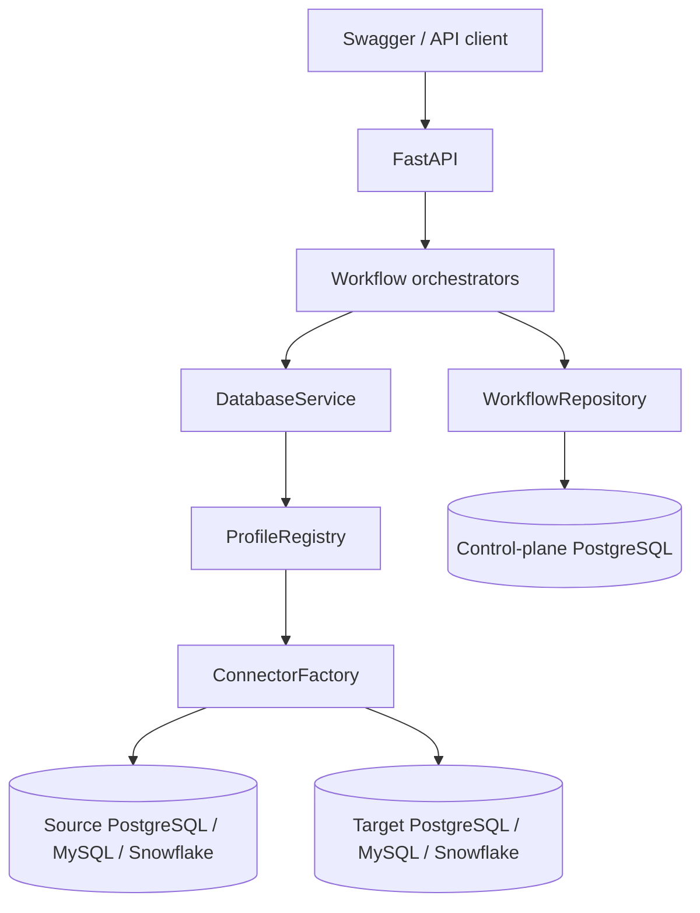

# SchemaBridge

SchemaBridge is a governed PostgreSQL, MySQL, and Snowflake migration backend. It discovers schemas, proposes deterministic column mappings, requires human approval, compiles target-specific SQL, records execution attempts, validates source and target aggregates, and preserves an auditable workflow history.

It is a governed batch-migration backend rather than a general streaming platform. Work can run through the synchronous workflow API or durable queued jobs processed by the run-once worker. After mapping approval, SchemaBridge creates a managed staging table in the selected target, loads source rows through automatically selected Spark or bounded connector batches, and generates the final `INSERT ... SELECT` from that exact table.

## Documentation

- [Product requirements](docs/PRD.md) — current behavior, scope, workflow, and limitations.
- [Architecture](docs/ARCHITECTURE.md) — components, request paths, databases, and design decisions.
- [Setup](docs/SETUP.md) — clean-machine setup, configuration, operation, and troubleshooting.
- [Automatic Spark transport](docs/SPARK_TRANSPORT.md) — large-table routing, safety boundary, and local verification.
- [Code guide](docs/CODE_GUIDE.md) — a recommended study order and file-by-file navigation.

## Architecture at a glance


```mermaid
flowchart TB
    Client["Swagger / API client"] --> API["FastAPI"]
    API --> Orchestrators["Workflow orchestrators"]
    Orchestrators --> DatabaseService["DatabaseService"]
    DatabaseService --> Profiles["ProfileRegistry"]
    Profiles --> Factory["ConnectorFactory"]
    Factory --> Source[("Source PostgreSQL / MySQL / Snowflake")]
    Factory --> Target[("Target PostgreSQL / MySQL / Snowflake")]
    Orchestrators --> Repository["WorkflowRepository"]
    Repository --> Control[("Control-plane PostgreSQL")]
```

The source and target are data-plane systems. The separate control-plane PostgreSQL database stores workflow state, immutable artifacts, idempotency records, execution and validation attempts, and append-only audit events. It does not store migrated business rows.

## Current workflow

1. Create a workflow with named source and target profiles.
2. Discover canonical source and target metadata.
3. Generate deterministic, evidence-backed mapping suggestions.
4. Record human approval or overrides as a new immutable artifact.
5. Claim a transport attempt, create managed target staging, and load source rows with automatic Spark routing for eligible large PostgreSQL, MySQL, or Snowflake tables, or bounded connector batches otherwise.
6. Compile a target-specific transformation preview from the approved plan and recorded staging evidence.
7. Recompile, verify, claim, and execute the approved statement.
8. After a confirmed commit, remove SchemaBridge-managed staging and persist cleanup evidence.
9. Run generated read-only aggregate checks on source and target.
10. Reconcile results into `VALIDATED` or `VALIDATION_REVIEW_REQUIRED`.

The lower-level `/api/v1/migrations` endpoints expose individual discovery, mapping, preview, and validation operations. The durable `/api/v1/migrations/workflows` endpoints add state transitions, artifacts, audit history, idempotency, optimistic concurrency, execution claims, and recovery states.

Live verification on 2026-08-15 moved five PostgreSQL rows through a SchemaBridge-created Snowflake staging table in three batches, committed five target inserts, passed all 13 aggregate checks, confirmed that exact replays did not duplicate rows, and removed managed staging while preserving the five target rows.

## Key safety properties

- The workflow API never accepts arbitrary migration SQL from a client.
- Execution is tied to an immutable approved mapping artifact and recompiles SQL before use.
- Identifiers are quoted and literal expression values use bound parameters.
- Target writes require a matching target profile with `write_enabled=true`.
- Every mutation requires an `Idempotency-Key`; later mutations also require the expected workflow version.
- Immutable, hashed artifacts preserve discovery, approval, preview, execution, and validation evidence.
- Concurrent transport, execution, and validation are guarded by durable control-plane claims.
- A remote outcome that cannot be proved is quarantined in a recovery state instead of retried automatically.
- Only an exact `SB_STAGE_<UUID>` relation is eligible for automatic cleanup, and uncertain execution keeps it for investigation.
- Public errors and audit metadata exclude credentials, DSNs, hosts, query parameters, and raw driver failures.

## Quick start

Prerequisites: Git and Python 3.12 or newer. Docker Compose v2 is optional unless you want the containerized control plane.

Windows PowerShell:

```powershell
git clone <repository-url>
cd schemabridge
PowerShell -ExecutionPolicy Bypass -File .\scripts\setup.ps1
Copy-Item .\.env.example .\.env
.\.venv\Scripts\python.exe -m pytest -q
.\.venv\Scripts\python.exe -m scripts.demo_workflow
```

POSIX shell:

```bash
git clone <repository-url>
cd schemabridge
python3 -m venv .venv
. .venv/bin/activate
python -m pip install "pip>=26.1.2"
python -m pip install -r requirements-dev.txt
cp .env.example .env
python -m pytest -q
python -m scripts.demo_workflow
```

The normal tests and default demo are credential-free. The demo creates and inspects a control-plane workflow; it does not claim a real Snowflake migration.

To inspect the ordered control-plane migrations without connecting:

```powershell
.\.venv\Scripts\python.exe -m scripts.migrate_control_plane --check
```

To run the API with a local control plane, first configure `.env`, then:

```powershell
docker compose up -d control-plane
.\.venv\Scripts\python.exe -m scripts.migrate_control_plane
.\.venv\Scripts\python.exe -m uvicorn schemabridge.api.app:create_app --factory --env-file .env --host 127.0.0.1 --port 8000
```

Open Swagger UI at <http://localhost:8000/docs>. See [SETUP.md](docs/SETUP.md) for named PostgreSQL, MySQL, and Snowflake profiles, required credentials, Docker Compose, environment variables, and troubleshooting.

### React frontend

With the API running in one terminal, start the local frontend in another:

```powershell
cd frontend
npm install
npm run dev
```

Open the address Vite prints (normally <http://localhost:5173>). The first screen is a guided migration overview and checks whether the local FastAPI process is reachable. It does not run database operations. Vite forwards local `/health` and `/api` requests to the API at `127.0.0.1:8000`; use `frontend/.env.example` when a deployed frontend needs a different API address.

To run the opt-in live browser proof (Docker PostgreSQL → React → FastAPI → PostgreSQL), install Playwright's Chromium runtime once, then run:

```powershell
cd frontend
npx playwright install chromium
cd ..
.\scripts\run_frontend_e2e.ps1
```

The script creates an isolated, randomly named local PostgreSQL database with tiny test tables. It proves both the guided migration path and a queued job processed by one local worker, then removes the entire temporary database and its temporary local processes afterward. Your normal Docker control-plane database is not used for this proof.

## Repository layout

```text
schemabridge/api/                 FastAPI routes, schemas, adapters, and wiring
schemabridge/connectors/          PostgreSQL, MySQL, Snowflake, and generic connectors
schemabridge/mapping/             Schema suggestions, approval, and transformation SQL
schemabridge/validation/          Validation SQL, execution, reconciliation, and SQL safety
schemabridge/services/workflows/  Durable workflow orchestration and persistence policy
schemabridge/services/jobs/       Background-job lifecycle, pipeline, runtime, and worker
schemabridge/transport/spark/     Automatically selected Spark transport implementation
schemabridge/persistence/         Control-plane repository, codecs, and migrations
tests/                            Credential-free tests and optional live contracts
scripts/                          Setup, verification, migrations, demos, and worker commands
docs/                             Product, architecture, setup, and study guides
frontend/                         React and TypeScript operator interface
```

## Current limitations

- Batch transport selects source-reader and staging-writer roles by connector capability, not by vendor name. PostgreSQL, MySQL, and Snowflake currently implement both roles.
- PostgreSQL, MySQL, and Snowflake have an optional, automatically selected Spark staging path for eligible large tables. PostgreSQL/MySQL use JDBC partitioning; Snowflake uses its dedicated Spark connector when that runtime package is configured.
- Validation compares generated aggregates, not every row.
- Uncertain remote outcomes require manual investigation.
- The initial React operator interface supports workflow creation, schema discovery, mapping review and approval, guided execution, durable background-job submission, and job/history viewing. Authentication, file ingestion, profiling, and production deployment remain to be added.
- SQL Server remains a generic connector only. The three supported durable databases have mostly unit/fake-driver coverage; live end-to-end coverage remains limited.
- Static packaging and Compose configuration are tested; a running Docker deployment is not claimed as verified here.

For a guided credential-free demonstration, see [LOCAL_WORKFLOW_DEMO.md](docs/LOCAL_WORKFLOW_DEMO.md). For interview preparation, see [INTERVIEW_DEMO.md](docs/INTERVIEW_DEMO.md).
